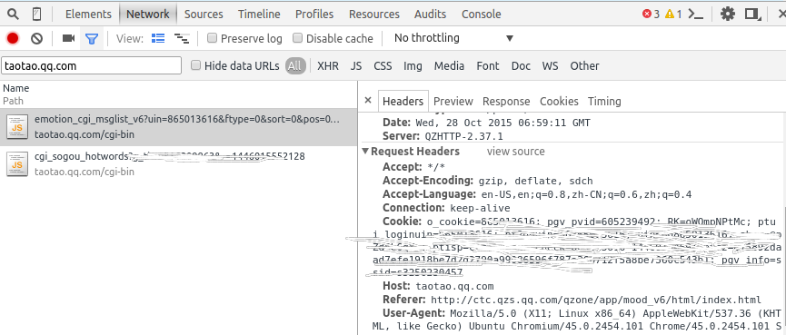
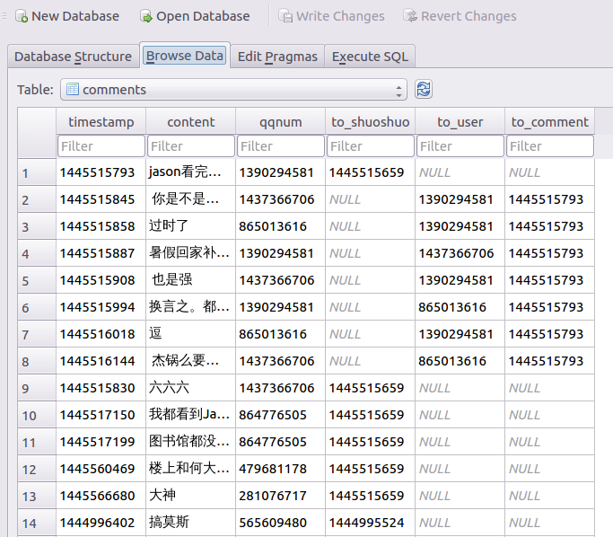

#功能
备份QQ空间说说(先用浏览器登陆获取Cookie)

#用法
先将Cookie及用户写入`config.json`中，格式如下

```language
{
	"shuoshuo":"<shuoshuo_cookie>",
	"friends":"<friends_cookie>",
	"user":"<your_qq_number>",
	"host_user":"<the_owner_qq>"
}
```

然后
```language
python shuoshuo.py config.json
```

若出现错误，可能是`friends`的cookie的问题，把函数`set_config`中设置`friends_skey`语句中的`p_key`改成`skey`试试


# 获取Cookie

## 获取"说说"Cookie
登录QZone，按F12打开浏览器调试窗口。点击进入`说说`(非`个人中心`)。在调试窗口`Network`面板中搜索`taotao.qq.com`，找到`emotion_cgi_msglist_v6`项。点击详情，在`Request Headers`中找到`Cookie`并记录之。



## 获取friends Cookie
程序首先获取好友列表。同上，在获取到“说说”的Cookie之后，继续在`Network`面板中搜索`friends`，找到包含`friends`的URL项，同理可获得Cookie


#说说解析

说说以`json`格式传到客户端。下面对其格式进行分类解析，也即解析`msglist`中数据格式

```language
{
	"msglist":[
		{
			... //数据格式在下面分类解析
		},...
	]
}
```

##纯文本
```language
{
	"content":"说说内容",
	"created_time":timestamp
}
```

`content`,`created_time`必然存在于每条说说。前者内容可以为空。下面所有类型将二者省略不写。

##图文
```language
{
	"pic":[
		{
			"pic_id":"图片id", // 格式为"your_qq_number,*****,*****"
			"url2":"最大图链接"
		},...
	]
}
```

##转发
```language
{
	"pic":[
		{
			"pic_id":"图片id", // 格式为",*****,*****"
			"url2":"最大图链接"
		},...
	],
	"rt_uin": 源作者QQ号,
	"rt_uinname":"源作者备注",
	"rt_createTime":"源说说创建时间" // 格式"YYYY年MM月DD日",
	"rt_con":{
		"content":"源作者所著内容"
	}
}
```

若转发纯文本，则`pic`项不存在

##评论
`cmtnum`=0则`commentlist`不存在

```language
{
	"cmtnum":评论数,即原始评论数，不包含回复
	"commentlist":[
		{
			"content":"评论内容",
			"create_time":评论时间,
			"name":"评论者备注",
			"uin":评论者QQ号,
			"reply_num":在此评论下子评论(回复)数量,
			"list_3":[
				{
					"content":"评论（回复）内容",
					"create_time":评论时间,
					"name":"评论者备注",
					"uin":评论者QQ号,
				}...
			],
			"pictotal":图片总数
			"pic":[
				{
					"hd_url":"最大图片地址"
				}...
			]
		}...
	]
}
```

若`reply_num`不为0，则在其同级目录下会有`list_3`。`reply_num`为`list_3`中项目个数。此列表与上面的评论列表一样，是按评论的时间先后顺序排列的。


要是评论中有图片，在评论的同级目录下会有`pic`以及`pictotal`。只有顶级评论中才能加图片，不能在回复中添加图片。

二级评论（回复）中，`content`字段首部包含`@{uin:qq,nick:nickname,who:1,auto:1}`字段，用来表示回复谁。


#数据库模型
```language
CREATE TABLE friends(
	qqnum       INTEGER PRIMARY KEY,
	name        TEXT
);

CREATE TABLE shuoshuo(
	timestamp       INTEGER,
	content         TEXT,
	rt_qqnum        INTEGER,
	rt_timestamp    INTEGER,
	rt_content      TEXT,
	FOREIGN KEY(rt_qqnum) REFERENCES friends(qqnum)
);

CREATE TABLE comments(
	timestamp       INTEGER,
	content         TEXT,
	qqnum           TEXT NOT NULL,
	to_shuoshuo     INTEGER,
	to_user         INTEGER,
	to_comment      INTEGER,
	FOREIGN KEY(to_shuoshuo) REFERENCES shuoshuo(timestamp),
	FOREIGN KEY(to_comment) REFERENCES comments(timestamp),
	FOREIGN KEY(to_user) REFERENCES friends(qqnum)
);

CREATE TABLE pictures(
	id				INTEGER PRIMARY KEY AUTOINCREMENT,
	url				TEXT NOT NULL,
	to_shuoshuo		INTEGER,
	to_comment    	INTEGER,
	FOREIGN KEY(to_shuoshuo) REFERENCES shuoshuo(timestamp),
	FOREIGN KEY(to_comment) REFERENCES comment(timestamp)
);
```

##查询说说
首先，程序会获取用户的好友列表。并将其QQ号、昵称、备注存于数据库(包括用户本身)。表`shuoshuo`中，`content`可以为空，因为可以发图片说说。`rt`开头的字段记录转发信息，也可以为空。

## 查询图片
由于评论中也可以出现图片，因此表`pictures`中也要有`comment_id`字段。查询说说中的图片时，假若已知说说的id为`your_id`,使用以下SQL语句：

```language
SELECT * FROM pictures WHERE shuoshuo=your_id AND comment_id IS NULL;
```

假若要查询评论的图片,其id为`your_comment_id`，则使用下面的SQL语句进行查询:

```language
SELECT * FROM pictures WHERE shuoshuo IS NULL AND comment_id=your_comment_id;
```

## 查询评论
查询说说的顶级评论：

```language
SELECT * FROM comments WHERE to_shuoshuo=your_shuoshuo_id AND to_comment IS NULL;
```

查询顶级评论下的回复：

```language
SELECT * FROM comments WHERE to_shuoshuo IS NULL AND to_comment=your_comment_id;
```

顶级评论中，`to_user`字段为空，在次级评论中，可以查询到`to_user`字段。评论可以以`timestamp`进行排序，或者以`id`进行排序，因为存储时，是按照时间顺序存进去的。

##Attention
本来是准备只备份自己的，于是就有了数据库中表`friends`，而且还设置了指向它的外键。

当要备份别人的说说时，可能会出现问题。但是我试了以下好像并没有完整性异常。。。。

有问题的话就把外键删了好了。

##示例
